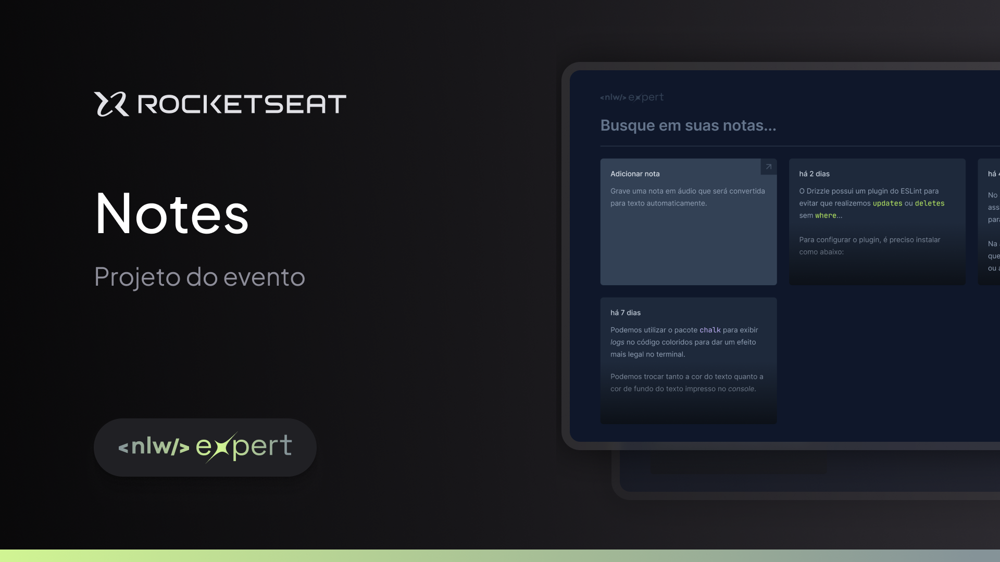

# 📝 Notes

Este repositório contém o código fonte e os arquivos relacionados a masterclass **NLW Expert - React** da **Rocketseat**. O projeto tem como objetivo fornecer uma introdução ao uso do SpeechRecognition para converter pronúncias verbais em transcrições precisas em uma aplicação ReactJS. Este recurso, integrado aos navegadores modernos, proporciona uma solução robusta para aplicativos web que demandam a conversão ágil e precisa de áudio para texto.

## 📂 Estrutura do Repositório

O repositório está estruturado da seguinte forma:
```
desafio-todo-rockectseat-reactjs-ts/
|-- src/
	| |-- assets/
		| | |-- Image1.png
		| | |-- Image2.svg
		| | |-- ...
	| |-- components/
		| | |-- Component1.tsx
		| | |-- Component2.tsx
		| | |-- ...
	| |-- App.tsx
|-- public/
	| |-- index.html
|-- ...
|-- README.md
|-- ...
```

- 📁 **src**: Contém os arquivos TypeScript do projeto, organizados em pastas como `components/` para componentes reutilizáveis e `pages/` para as páginas principais do aplicativo.
- 🌐 **public**: Contém o arquivo `index.html`, que serve como o ponto de entrada da aplicação React.

## 🚀 Como Iniciar o Projeto
Necessita de `Node.js v20+` para rodar.

Clone este repositório para o seu ambiente local:
```
https://github.com/Wellington-Henrique/nlw-expert-notes.git
````

Instale as dependências do projeto:
```
npm i
```

Inicie a aplicação:
```
npm run dev
```

Isso iniciará a aplicação em modo de desenvolvimento. Abra http://localhost:5173/ no seu navegador para visualizar a aplicação.
	
## 🛠 Tecnologias Utilizadas
- 🚀 **[ReactJS](https://reactjs.org/):** Uma biblioteca JavaScript para construção de interfaces de usuário.
- 🔍 **[TypeScript](https://www.typescriptlang.org/):** Uma linguagem superset JavaScript que adiciona tipagem estática opcional.
- ⚡ **[Vite](https://vitejs.dev/):** Um construtor de aplicações JavaScript rápido e flexível.
- 🎨 **[Tailwind CSS](https://tailwindcss.com/):** Esta biblioteca de utilitários CSS oferece uma abordagem única, baseada em classes, para o design responsivo, proporcionando flexibilidade e eficiência no desenvolvimento de interfaces modernas.

## Logo do Projeto


Contribuição

Se você encontrar problemas, bugs ou tiver sugestões para melhorar este projeto, sinta-se à vontade para abrir uma issue ou enviar um pull request.

## 📜 Licença
MIT